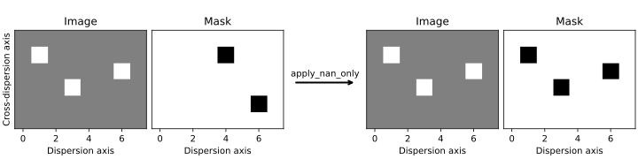

.. _mask_treatment:

Treatment of masked and non-finite pixel values
===============================================

Specreduce provides several options for handling images that contain masked or non-finite pixels.
These options allow users to decide whether to preserve, modify, or remove invalid data.

The mask treatment option is selected using the ``mask_treatment`` argument in class initializers,
methods, and functions where applicable. Note that different classes and procedures within Specreduce
may support only a subset of these options.

Available Options
-----------------

- ``apply``
  The input image is left unmodified. Any pixel that is non-finite (e.g., NaN or infinity) is marked as
  masked, and if an existing mask is present, it is combined with the mask derived from non-finite values.

- ``ignore``
  The input image remains unchanged, and any existing mask is discarded. Non-finite values are neither
  masked nor replaced.

- ``propagate``
  The image data remains unchanged. However, if any pixel is masked or non-finite, the entire
  cross-dispersion axis containing that pixel is marked as masked.

- ``zero_fill``
  All pixels that are masked or non-finite are replaced with ``0.0`` and the the mask
  is cleared from the image.

- ``nan_fill``
  Similar to zero_fill, but instead of replacing invalid pixels with ``0.0``, they are replaced
  with ``nan``. The mask is then removed from the image.

- ``apply_mask_only``
  The image and its mask are returned as provided. Only the existing mask is applied without
  incorporating non-finite value checks.

- ``apply_nan_only``
  The input image is returned unaltered, but any existing mask is ignored. A new mask is generated
  solely based on non-finite pixels.

