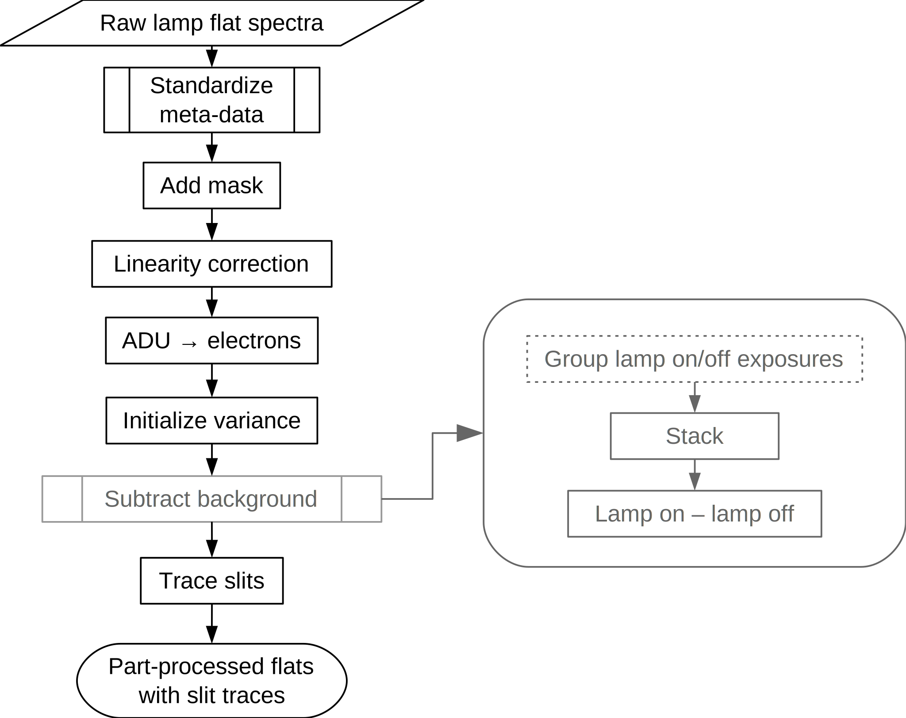

*************************
Near-IR, multi-slit flats
*************************

   Tracing of lamp flat spectra.
   Steps in grey are optional or alternative processing steps.

.. figure:: NIR_MOS_flat.svg
   :height: 1200
   :width: 600
   :scale: 50 %
   :alt: DR flowchart for multi-slit lamp flat processing.

   Reduction of lamp flat spectra to produce a normalized flat.
   Steps in grey are optional or alternative processing steps.

