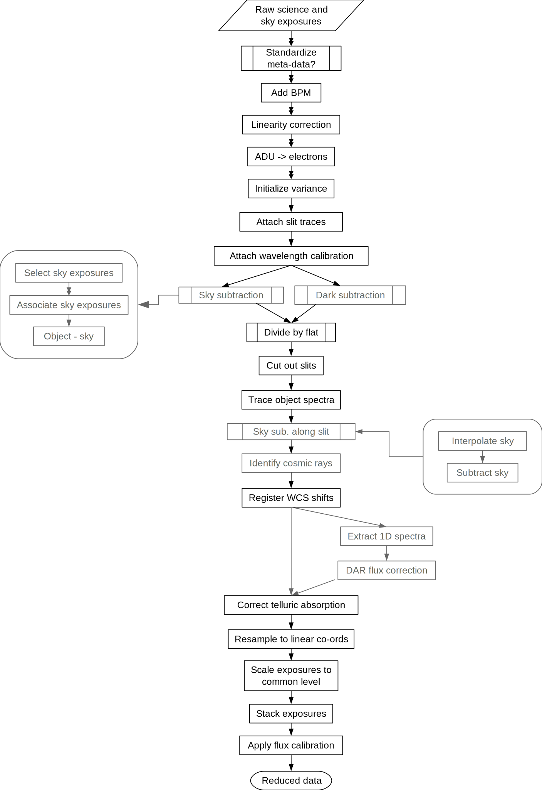

********************************
Near-IR, multi-slit science data
********************************

This example is based on plans for reduction of near-infrared, multi-slit
spectra with a single detector array.

   Reduction of science exposures using previously-processed calibrations.
   Steps in grey are alternative processing options.
